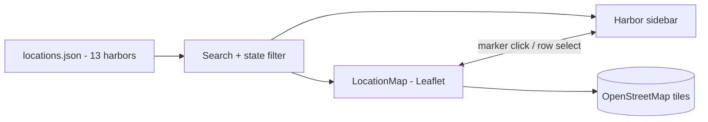

<p align="center">
  
</p>

<h1 align="center">Hollingshead Harbor</h1>

<p align="center">
  <b>SRM Concrete's marine transportation division — bulk cargo, charter, and full-service ports.</b>
</p>
<p align="center">
  A static React marketing site for vessel and barge charter across a 13-harbor network,<br />
  putting customers in front of an interactive map and a regional sales rep.
</p>

<p align="center">
  <a href="https://hollingsheadharbor.com"></a>
  
  
  
  
  
  
</p>

<br />

## Why Hollingshead Harbor

Hollingshead Harbor is the marine transportation division of SRM Concrete, and its
customers need two things fast: to see where the harbors are and to reach a rep who
can move their cargo. This site answers both. It is a single-page React app with no
backend — the team, six services, and all 13 harbors ship as local JSON — so an
interactive OpenStreetMap map, a searchable harbor directory, and a "Find a Sales
Rep" hand-off all run as static content on Vercel, with nothing to key or provision.

<table width="100%">
  <tr>
    <td width="33%" valign="top">
      <h3 align="center">Static React SPA</h3>
      <p align="center">No backend or database. Team, services, and every harbor are served from local JSON, so content updates need no code changes.</p>
    </td>
    <td width="33%" valign="top">
      <h3 align="center">Interactive harbor map</h3>
      <p align="center">A Leaflet + OpenStreetMap map plots all 13 harbors, synced two-way with a searchable, state-filtered sidebar — and needs no API key.</p>
    </td>
    <td width="33%" valign="top">
      <h3 align="center">One shared layout</h3>
      <p align="center">A single nested React Router layout renders the two-tier sticky header, footer, and scroll restoration across every route.</p>
    </td>
  </tr>
</table>

<br />

## Getting started

```bash
npm install
npm run dev        # Vite dev server
npm run build      # production build to dist/
npm run preview    # preview the production build
```

| Script           | What it does                                  |
| :--------------- | :-------------------------------------------- |
| `npm run dev`    | Start the Vite dev server                     |
| `npm run build`  | Build the production bundle to `dist/`        |
| `npm run preview`| Serve the built bundle locally                |
| `npm run lint`   | Run ESLint over the project                   |
| `npm run format` | Format `src/` with Prettier (`--write`)       |

## Stack

| Layer     | Choice                                                                  |
| :-------- | :---------------------------------------------------------------------- |
| Framework | React 19 + React Router 7                                               |
| Build     | Vite 7                                                                   |
| Styling   | Tailwind CSS 3 — SRM navy `#2a3163` / red `#dc2626`, Fraunces + Inter   |
| Map       | Leaflet + OpenStreetMap tiles (no API key)                             |
| Content   | Static JSON — team, services, harbors                                   |
| Hosting   | Vercel (SPA rewrites in `vercel.json`)                                  |

## Routes

| Route             | What it is                                                         |
| :---------------- | :---------------------------------------------------------------- |
| `/`               | Home — hero, why Hollingshead, services preview, harbors, CTA     |
| `/about`          | The division, its core services and values within the SRM family  |
| `/story`          | Company history from Mike Hollingshead's 1999 founding of SRM      |
| `/team`           | Leadership cards driven by `team.json`                            |
| `/services`       | Six marine and port services from `services.json`                 |
| `/locations`      | Interactive Leaflet map + searchable, filterable harbor sidebar   |
| `/privacy-policy` | Privacy policy                                                    |
| `*`               | 404 Not Found                                                     |

## Locations & map

The Locations page is the site's most interactive surface. Every harbor lives in
`locations.json`; the page filters that list by search text (name or city) and by
state, then feeds the result into both a Leaflet map and a sidebar. Selecting a
harbor in either view syncs the other — clicking a marker highlights its row, and
picking a row pans the map and opens the popup. Tiles come straight from
OpenStreetMap, so there is no API key or map account to manage.



## How it works

- **Content is fully static.** `team.json`, `services.json`, and `locations.json` drive the team, services, and harbor pages, so updates need no code changes.
- **One shared hero.** Every page renders one `HeroSection` — a slow-panning background image masked by an SVG wave.
- **Reveal on scroll.** A `useScrollAnimation` hook reveals sections as they enter the viewport via `IntersectionObserver`, with staggered timing.
- **Sticky, responsive header.** A two-tier sticky bar compresses on scroll and collapses to a slide-down drawer on mobile, with a "Find a Sales Rep" call to action that hands off to SRM's rep finder.
- **First-party analytics.** A `SundayAnalyticsProvider` (`lib/sunday-analyzer`) wraps the app and reports cookieless page views to a first-party ingest endpoint — no Google Analytics or third-party tracker.

## Project structure

```
src/
  components/   Header, Footer, HeroSection, LocationMap, Layout, ScrollToTop, …
  pages/        Home, About, Story, Team, Services, Locations, PrivacyPolicy, NotFound
  data/         team.json · services.json · locations.json
  constants/    navigation.js · urls.js
  hooks/        useScrollAnimation.js (IntersectionObserver reveal)
  lib/          sunday-analyzer — first-party page analytics
  App.jsx       routes wrapped in the shared Layout
  main.jsx      entry
  index.css     Tailwind layers + keyframes
public/         logo.jpg, background.jpg, team & harbor photos, fav.png
```

## License

Private project — all rights reserved. Made by [TaylorURL](https://taylorurl.com).

<br />

<p align="center">
  <sub>13 harbors, one map, and a rep a click away — SRM Concrete on the water.</sub>
</p>
