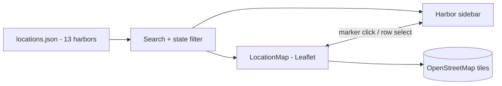

<p align="center">
  
</p>

<h1 align="center">Hollingshead Harbor</h1>

<p align="center">
  Official site for <a href="https://hollingsheadharbor.com">hollingsheadharbor.com</a> — SRM Concrete's marine transportation division: bulk cargo, vessel and barge charter, and full-service ports across a 13-harbor network. Puts customers in front of the map and a regional sales rep.
</p>

<p align="center">
  
  
  
  
  
  
</p>

- **Static React SPA** — no backend or database; team, services, and all 13 harbors are served from local JSON files.
- **Interactive harbor map** — a Leaflet + OpenStreetMap map plots every harbor as a marker, synced two-way with a searchable, state-filtered sidebar, and needs no API key.
- **One shared layout** — a single nested React Router layout renders the two-tier sticky header, footer, and scroll restoration across all seven routes.

## Stack

| Layer | Choice |
|-------|--------|
| Framework | React 19 + React Router 7 |
| Build | Vite 7 |
| Styling | Tailwind CSS 3 — SRM navy `#2a3163` / red `#dc2626`, Fraunces + Inter |
| Map | Leaflet + OpenStreetMap tiles (no API key) |
| Content | Static JSON — team, services, harbors |
| Hosting | Vercel (SPA rewrites in `vercel.json`) |

## Getting started

```bash
npm install
npm run dev        # Vite dev server
npm run build      # production build
npm run preview    # preview the build
npm run lint       # eslint
npm run format     # prettier --write
```

## Routes

| Route | What it is |
|-------|-----------|
| `/` | Home — hero, why Hollingshead, services preview, harbor network, CTA |
| `/about` | The division, its core services and values within the SRM family |
| `/story` | Company history from Mike Hollingshead's 1999 founding of SRM |
| `/team` | Leadership cards driven by `team.json` |
| `/services` | Six marine and port services from `services.json` |
| `/locations` | Interactive Leaflet map + searchable, filterable harbor sidebar |
| `/privacy-policy` | Privacy policy |
| `*` | 404 Not Found |

## Locations & map

The Locations page is the site's most interactive surface. Every harbor lives in
`locations.json`; the page filters that list by search text (name or city) and by
state, then feeds the result into both a Leaflet map and a sidebar. Selecting a
harbor in either view syncs the other — clicking a marker highlights its row, and
picking a row pans the map and opens the popup. Tiles come straight from
OpenStreetMap, so there is no API key or map account to manage.



## Content & interaction

Content is fully static: `team.json`, `services.json`, and `locations.json` drive
the team, services, and harbor pages, so updates need no code changes. Every page
shares one `HeroSection` — a slow-panning background image masked by an SVG wave —
and a `useScrollAnimation` hook that reveals sections on scroll via
`IntersectionObserver` with staggered timing. The header is a two-tier sticky bar
that compresses on scroll and collapses to a slide-down drawer on mobile, with a
"Find a Sales Rep" call to action that hands off to SRM's rep finder.

## Project structure

```
src/
  components/   Header, Footer, HeroSection, LocationMap, Layout, ScrollToTop, …
  pages/        Home, About, Story, Team, Services, Locations, PrivacyPolicy, NotFound
  data/         team.json · services.json · locations.json
  constants/    navigation.js · urls.js
  hooks/        useScrollAnimation.js (IntersectionObserver reveal)
  lib/          sunday-analyzer — first-party page analytics
  App.jsx       routes wrapped in the shared Layout
  main.jsx      entry
  index.css     Tailwind layers + keyframes
public/         logo.jpg, background.jpg, team & harbor photos, fav.png
```

## License

Private project — all rights reserved. Made by [TaylorURL](https://taylorurl.com).
