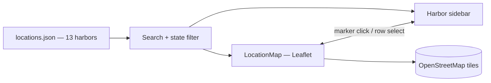

<p align="center">
  
</p>

<h1 align="center">Hollingshead Harbor</h1>

<p align="center">
  <b>Marine transportation — bulk cargo, vessel and barge charter, full-service ports.</b>
</p>
<p align="center">
  The official site for SRM Concrete's marine division and its 13-harbor network.<br />
  Live at <a href="https://hollingsheadharbor.com">hollingsheadharbor.com</a>.
</p>

<p align="center">
  
  
  
  
  
  
  
</p>

<br />

## Why Hollingshead Harbor

A shipper's first question is "do you have a harbor near me, and who do I call?" The site is built around that answer: an interactive map of all 13 harbors, a searchable and state-filtered list synced to it, and a sales-rep handoff on every page. There is no backend and no map account — the content is JSON in the repo and the tiles come from OpenStreetMap.

<table width="100%">
  <tr>
    <td width="50%" valign="top">
      <h3 align="center">Two-way map and list</h3>
      <p align="center">Clicking a marker highlights its row; picking a row pans the map and opens the popup. Both views read the same filtered harbor list.</p>
    </td>
    <td width="50%" valign="top">
      <h3 align="center">Content without a CMS</h3>
      <p align="center">Team, services, and harbors are three JSON files. Adding a harbor or a leader is a data edit, not a code change.</p>
    </td>
  </tr>
</table>

<br />

## Stack

| Layer | Technology |
| :--- | :--- |
| UI | React 19 + React Router 7 |
| Build & dev | Vite 7 |
| Styling | Tailwind CSS 3 — SRM navy `#2a3163` / red `#dc2626`, Fraunces + Inter |
| Map | Leaflet + OpenStreetMap tiles (no API key) |
| Content | Static JSON — team, services, harbors |
| Analytics | First-party, cookieless beacon (`src/lib/sunday-analyzer`) |
| Hosting | Vercel (SPA rewrites in `vercel.json`) |

## Getting started

```bash
npm install
npm run dev           # Vite dev server
npm run build         # production build to dist/
```

No environment configuration is required — the site has no backend, no database, and no map API key.

### Scripts

| Script | Does |
| :--- | :--- |
| `npm run dev` | Start the Vite dev server. |
| `npm run build` | Production build to `dist/`. |
| `npm run preview` | Serve the production build locally. |
| `npm run lint` | Lint with ESLint. |
| `npm run format` | Format `src/**` with Prettier. |
| `npm run format:check` | Check formatting without writing. |

## Routes

Every route renders inside one nested `Layout` — two-tier sticky header, footer, and scroll restoration.

| Route | Renders |
| :--- | :--- |
| `/` | Hero, why Hollingshead, services preview, harbor network, CTA |
| `/about` | The division, its core services, and its place in the SRM family |
| `/story` | Company history from Mike Hollingshead's 1999 founding of SRM |
| `/team` | Leadership cards from `team.json` |
| `/services` | Six marine and port services from `services.json` |
| `/locations` | Leaflet map + searchable, state-filtered harbor sidebar |
| `/privacy-policy` | Privacy policy |
| `*` | Not found |

## Architecture


```mermaid
flowchart LR
    J["locations.json — 13 harbors"] --> F["Search + state filter"]
    F --> M["LocationMap — Leaflet"]
    F --> S["Harbor sidebar"]
    M <-->|"marker click / row select"| S
    M --> T[("OpenStreetMap tiles")]
```

## How it works

- **The locations page is the product.** Harbors are filtered by search text (name or city) and by state, and the result feeds both the map and the sidebar from a single source.
- **One hero, every page.** `HeroSection` renders a slow-panning background image masked by an SVG wave, so pages stay visually consistent without per-page art direction.
- **Sections reveal on scroll.** `useScrollAnimation` wraps `IntersectionObserver` with staggered timing.
- **The header adapts.** A two-tier sticky bar compresses on scroll and collapses to a slide-down drawer on mobile, with a "Find a Sales Rep" call to action that hands off to SRM's rep finder.
- **The palette is anchored to the parent brand.** `tailwind.config.js` builds navy and red scales around SRM's `#2a3163` / `#dc2626`, plus warm "sand" and cool "mist" surface tints and a deep "hull" tone for heroes.

## Project structure

```
hollingsheadharbor-com/
├── public/                    Logo, hero background, team + operations photos, favicon
└── src/
    ├── App.jsx                Routes wrapped in the shared Layout
    ├── main.jsx               Browser entry
    ├── index.css              Tailwind layers + keyframes
    ├── components/            Header, Footer, HeroSection, LocationMap, Layout, ScrollToTop, …
    ├── pages/                 Home, About, Story, Team, Services, Locations, PrivacyPolicy, NotFound
    ├── data/                  team.json · services.json · locations.json
    ├── constants/             navigation.js · urls.js
    ├── hooks/                 useScrollAnimation.js (IntersectionObserver reveal)
    └── lib/sunday-analyzer/   First-party cookieless analytics provider
```

## License

Copyright (c) 2026 Trenton Taylor. All rights reserved. See [LICENSE.md](LICENSE.md).

<br />

<p align="center">
  <sub>Built by <a href="https://taylorurl.com">TaylorURL</a> — custom sites for local businesses.</sub>
</p>
