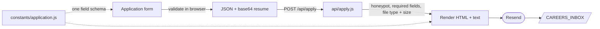

<p align="center">
  
</p>

<h1 align="center">Hollingshead Harbor</h1>

<p align="center">
  <b>Marine transportation — bulk cargo, vessel and barge charter, full-service ports.</b>
</p>
<p align="center">
  The official site for SRM Concrete's marine division and its 13-harbor network.<br />
  Live at <a href="https://hollingsheadharbor.com">hollingsheadharbor.com</a>.
</p>

<p align="center">
  
  
  
  
  
  
</p>

<br />

## Why Hollingshead Harbor

Most applicants fill this out on a phone, standing on a dock, and they will not come back for a second attempt. So the whole employment application sits on one page, checks itself before it submits, and lands in the hiring inbox as a formatted email with the resume attached. The other four pages cover who the company is, what it runs, and who to call.

<table width="100%">
  <tr>
    <td width="50%" valign="top">
      <h3 align="center">The application, in one page</h3>
      <p align="center">Position, contact details, four employers, personal history, and a signed acknowledgment. Checked in the browser, then checked again on the server before anything is sent.</p>
    </td>
    <td width="50%" valign="top">
      <h3 align="center">Content without a CMS</h3>
      <p align="center">Job postings and fleet equipment are two JSON files. Adding a boat or a job description is a data edit, not a code change.</p>
    </td>
  </tr>
</table>

<br />

## Stack

| Layer | Technology |
| :--- | :--- |
| UI | React 19 + React Router 7 |
| Build & dev | Vite 7 |
| Styling | Tailwind CSS 3, Inter, SRM navy `#2a3163` and red `#dc2626` |
| Application delivery | Vercel Function (`api/apply.js`) + Resend |
| Content | Static JSON: job postings, fleet equipment |
| Analytics | First-party, cookieless beacon (`src/lib/sunday-analyzer`) |
| Hosting | Vercel (SPA rewrites in `vercel.json`) |

## Getting started

```bash
npm install
npm run dev           # Vite dev server
npm run build         # production build to dist/
```

`npm run dev` serves the site but not `api/`. To exercise the application endpoint locally, run `vercel dev` instead, which serves both.

### Environment

Three variables, set in Vercel and required only by `api/apply.js`. Without them the endpoint returns a 500 and the form shows its error state.

| Variable | Holds |
| :--- | :--- |
| `RESEND_API_KEY` | Resend key, send-only scope |
| `CAREERS_INBOX` | Where applications are delivered; comma-separate for more than one recipient |
| `CAREERS_FROM` | Sending address on a Resend-verified domain |

### Scripts

| Script | Does |
| :--- | :--- |
| `npm run dev` | Start the Vite dev server. |
| `npm run build` | Production build to `dist/`. |
| `npm run preview` | Serve the production build locally. |
| `npm run lint` | Lint with ESLint. |
| `npm run format` | Format `src/**` with Prettier. |
| `npm run format:check` | Check formatting without writing. |

## Routes

Every route renders inside one nested `Layout`: two-tier sticky header, footer, and scroll restoration.

| Route | Renders |
| :--- | :--- |
| `/` | Hero, why Hollingshead, harbor network, hiring and contact CTAs |
| `/about` | What the division does, the 1999 founding story, core values, the SRM family |
| `/equipment` | Fleet cards from `equipment.json`, or a specs-on-request panel while it is empty |
| `/careers` | Job postings from `positions.json` and the full employment application |
| `/contact` | Direct lines, the Murfreesboro and San Leon offices, and a careers handoff |
| `/privacy-policy` | Privacy policy |
| `*` | Not found |

## Architecture


```mermaid
flowchart LR
    F["Application form"] -->|"validate in browser"| P["JSON + base64 resume"]
    P -->|"POST /api/apply"| A["api/apply.js"]
    A -->|"honeypot, required fields, file type + size"| R["Render HTML + text"]
    R --> S(["Resend"])
    S --> I[/"CAREERS_INBOX"/]
    C["constants/application.js"] -.->|"one field schema"| F
    C -.-> R
```

## How it works

- **One schema drives the form and the email.** `constants/application.js` declares the sections and the employer field list once. The form renders from it and the email prints from it, which keeps a field from existing on one side and not the other.
- **Validation runs twice.** The browser blocks submission and marks every offending field in red. The endpoint then re-checks the fields it refuses to send without, since anything reaching a public URL can skip the browser entirely.
- **Applicant data is never logged.** Applications carry a Social Security number and a date of birth, so `api/apply.js` logs failure messages only. The payload goes to the outbound email and nowhere else.
- **A hidden honeypot field returns success.** Bots that fill it get a 200 and no email is sent, so a scraper cannot tell rejection from delivery.
- **One hero component, every page.** `HeroSection` renders a photographic band under a navy wash with a red rule beneath it, so pages stay consistent without per-page art direction.
- **Sections reveal on scroll.** `useScrollAnimation` wraps `IntersectionObserver` with staggered timing.
- **The palette is anchored to the parent brand.** `tailwind.config.js` builds navy and red scales around SRM's `#2a3163` and `#dc2626`, plus warm "sand" and cool "mist" surface tints and a deep "hull" tone for heroes.

## Project structure

```
hollingsheadharbor-com/
├── api/
│   └── apply.js               Vercel Function: validates and mails an application
├── public/                    Logo, hero background, operations photos, favicon
└── src/
    ├── App.jsx                Routes wrapped in the shared Layout
    ├── main.jsx               Browser entry
    ├── index.css              Tailwind layers, buttons, scroll-reveal utilities
    ├── components/            Header, Footer, HeroSection, ApplicationForm, FormControls, …
    ├── pages/                 Home, About, Equipment, Careers, Contact, PrivacyPolicy, NotFound
    ├── data/                  positions.json · equipment.json
    ├── constants/             application.js · navigation.js · urls.js
    ├── hooks/                 useScrollAnimation.js (IntersectionObserver reveal)
    └── lib/sunday-analyzer/   First-party cookieless analytics provider
```

## License

Copyright (c) 2026 Trenton Taylor. All rights reserved. See [LICENSE.md](LICENSE.md).

<br />

<p align="center">
  <sub>Built by <a href="https://taylorurl.com">TaylorURL</a> — custom sites for local businesses.</sub>
</p>
